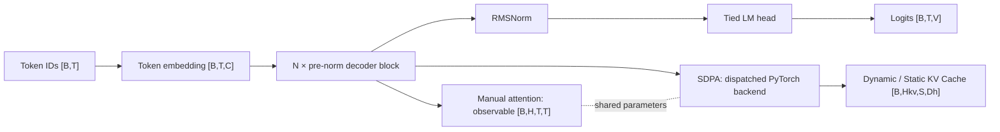
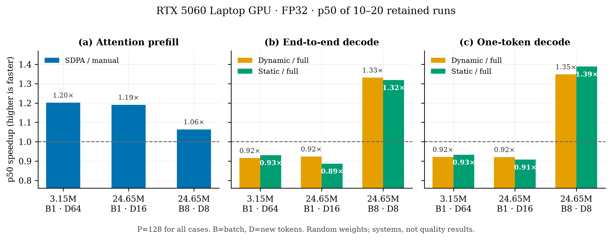

# TinyGPT Forge

[中文说明](README_zh.md)

TinyGPT Forge is a correctness-first GPT systems lab: one model definition, a readable manual
attention path, and a PyTorch SDPA path checked against the same parameters.

The project is local-first. Training, generation, tests, and benchmarks work without an API key.
An OpenAI-compatible client is an explicit experimental extension and never participates in CI.

Licensed under [Apache License 2.0](LICENSE). Third-party source and data obligations remain
documented separately.

## What is implemented?

| Capability | Status | Evidence |
|---|---|---|
| RMSNorm, RoPE, MHA/MQA/GQA, SwiGLU, pre-norm decoder | Verified | shape, property, causality, and gradient tests |
| Manual attention and PyTorch SDPA with shared weights | Verified | forward/backward equivalence tests |
| Dynamic and preallocated Static KV Cache | Verified | full/incremental logits and greedy-token equivalence |
| Character tokenizer and strict train/validation/test split | Verified baseline | deterministic fingerprint and OOV tests |
| Local training, gradient accumulation, best/last checkpoints | Verified baseline | CPU integration test and runnable example |
| Pickle-free training resume | Verified | uninterrupted vs interrupted/resumed bitwise test |
| Safetensors model/optimizer/RNG artifacts | Verified | exact reload and tamper detection |
| Raw-sample benchmark harness | Verified | warm-up, synchronization, repeats, percentiles, environment |
| OpenAI-compatible client | Experimental | offline mock tests; real paid endpoints are not tested in CI |
| `torch.compile`, DDP/FSDP, LoRA/QLoRA, quantization, serving | Planned | not advertised as supported |

FlashAttention is not available in the locally tested Windows PyTorch wheel. SDPA safely falls
back to the compiled backend, and benchmark files record the observed ATen operator instead of
assuming a kernel from configuration flags.

## Architecture



## Requirements and installation

- Python 3.10–3.14 is the declared range.
- PyTorch 2.3 or newer and earlier than 3.0 is required.
- The current local evidence environment is Python 3.14.3, PyTorch 2.11.0+cu128, and an NVIDIA
  GeForce RTX 5060 Laptop GPU. Other combinations remain CI or user-validation targets.

From a clean checkout:

```bash
python -m pip install -e .
tinygpt smoke --config configs/tiny_cpu.toml
```

On Windows, if several Python installations coexist, compare `python -m pip --version` with
`Get-Command tinygpt`. They must resolve to the same environment; otherwise activate the intended
environment or invoke its `Scripts/tinygpt.exe` explicitly.

Development tools are optional:

```bash
python -m pip install -e ".[dev]"
ruff check .
ruff format --check .
mypy src
python -m unittest discover -s tests -v
```

## Local training and generation

The example corpus is deliberately tiny. It validates the pipeline, not language quality.

```bash
tinygpt train-char --config configs/tiny_cpu.toml --text examples/tiny_corpus.txt --run-dir runs/tiny_cpu
tinygpt generate-char --checkpoint runs/tiny_cpu/checkpoints/best --tokenizer runs/tiny_cpu/tokenizer.json --prompt "TinyGPT" --max-new-tokens 32
```

On a CUDA device with BF16 support, the recorded five-step GPU smoke can be reproduced with:

```bash
tinygpt train-char --config configs/tiny_gpu_smoke.toml --text examples/tiny_corpus.txt --run-dir runs/tiny_gpu_smoke
tinygpt generate-char --checkpoint runs/tiny_gpu_smoke/checkpoints/best --tokenizer runs/tiny_gpu_smoke/tokenizer.json --prompt "TinyGPT" --max-new-tokens 16 --device cuda
```

The checked-in [RTX 5060 training artifact](results/training/rtx5060_bf16_smoke.json) records the
complete configuration and history, but no model weights. Its repetitive output proves the CUDA
save/reload/generation path only, not language quality.

Resume from the last evaluation checkpoint while increasing the target step:

```bash
tinygpt train-char --config configs/tiny_cpu.toml --text examples/tiny_corpus.txt --run-dir runs/tiny_cpu --resume-from runs/tiny_cpu/checkpoints/resume --max-steps 40
```

## Benchmark

```bash
tinygpt benchmark --config configs/tiny_cpu.toml --device cpu --warmup 2 --repeats 10 --output runs/benchmarks/cpu_smoke.json
```

On the tested RTX 5060 environment, SDPA prefill was about 1.06–1.22× faster than manual
attention for the recorded shapes. KV Cache was slower at batch 1, but crossed over at 24.65M
parameters, batch 8, prompt 128: Dynamic/Static end-to-end decode reached about 1.33×/1.32× and
Static steady-state single-token decode reached about 1.39×. These are shape-specific results,
not universal claims. See [the benchmark methodology and raw-artifact map](docs/10_benchmarks.md).



## Optional external endpoint

Copy `.env.example` and load it through your own shell or secret manager. The project never needs
these variables for local operation. A request is refused unless the caller explicitly passes the
cost acknowledgement flag:

```bash
tinygpt external-chat --prompt "Hello" --yes-i-understand-this-may-cost-money
```

External calls can transmit data and cost money. See [the provider security boundary](docs/09_serving_and_api.md).

## Documentation

- [Project and tensor-shape contract](docs/00_project_overview.md)
- [Optional API boundary](docs/09_serving_and_api.md)
- [Security review and trust boundaries](docs/security_review.md)
- [Benchmark method and conclusions](docs/10_benchmarks.md)
- [Source and license decision matrix](docs/source_and_license_matrix.md)
- [Roadmap and explicit non-goals](docs/roadmap.md)
- [Data card](docs/data_card.md) and [model/experiment card](docs/model_card.md)

## Limitations

- The bundled character corpus is a smoke fixture, not a research dataset.
- Current quality experiments are too small for useful language-quality claims.
- GPU results cover one Windows laptop and a limited shape grid.
- CUDA kernel timelines are unavailable because CUPTI initialization fails in the current setup;
  CPU-side profiler events still identify the dispatched ATen operator.
- Distributed training, quantization, production serving, and Hugging Face checkpoint conversion
  are not implemented stable features.

See [CONTRIBUTING.md](CONTRIBUTING.md) and [SECURITY.md](SECURITY.md) before contributing or
handling untrusted checkpoints.

## License

TinyGPT Forge is licensed under the [Apache License 2.0](LICENSE). References to papers and other
projects do not relicense their contents; see the [source and license matrix](docs/source_and_license_matrix.md).
