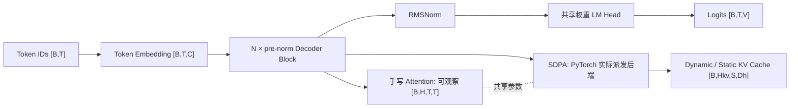

# TinyGPT Forge

[](https://github.com/Asuka0782/tinygpt-forge/actions/workflows/ci.yml)

[English README](README.md)

TinyGPT Forge 是一个“正确性优先”的 GPT 系统实验室：用同一份模型定义和同一套参数，
同时支撑可观察的手写 Attention 与 PyTorch SDPA 工程路径。

项目默认 local-first：训练、生成、测试和 benchmark 都不需要 API Key。OpenAI-compatible
客户端只是显式启用的实验扩展，不参与 CI，也不影响本地核心功能。

项目采用 [Apache License 2.0](LICENSE)。第三方源码与数据义务仍单独记录。

## 已实现能力

| 能力 | 状态 | 证据 |
|---|---|---|
| RMSNorm、RoPE、MHA/MQA/GQA、SwiGLU、pre-norm Decoder | 已验证 | shape、数学性质、因果性、梯度测试 |
| 同权重手写 Attention / SDPA | 已验证 | 前向与反向等价测试 |
| Dynamic / 预分配 Static KV Cache | 已验证 | full/incremental logits 与 greedy token 等价 |
| 字符 tokenizer、严格 train/validation/test 切分 | 基线已验证 | 确定性指纹和 OOV 测试 |
| 本地训练、梯度累积、best/last checkpoint | 基线已验证 | CPU 集成测试和可运行示例 |
| 无 pickle 的完整训练恢复 | 已验证 | 连续训练与中断恢复训练 bitwise 等价 |
| safetensors 模型/优化器/RNG 产物 | 已验证 | 精确重载和篡改检测 |
| 保留原始重复样本的 benchmark | 已验证 | warm-up、同步、重复、分位数、环境记录 |
| OpenAI-compatible 客户端 | experimental | 离线 mock；CI 不调用真实付费端点 |
| `torch.compile`、DDP/FSDP、LoRA/QLoRA、量化、服务 | 规划中 | 不宣称已支持 |

本机 Windows PyTorch wheel 没有编译 FlashAttention。项目会安全使用可用 SDPA 后端，并在
benchmark 中记录实际 ATen operator，而不是从配置开关推断 kernel。

## 架构



## 环境与安装

- 声明支持 Python 3.10—3.14。
- 需要 PyTorch 2.3 或更新、且低于 3.0 的版本。
- 当前本机实测环境是 Python 3.14.3、PyTorch 2.11.0+cu128、RTX 5060 Laptop GPU；
  这不等于所有声明组合都已实测。

从干净 checkout 开始：

```bash
python -m pip install -e .
tinygpt smoke --config configs/tiny_cpu.toml
```

Windows 上若并存多套 Python，请对照 `python -m pip --version` 与 `Get-Command tinygpt` 的路径。
两者必须属于同一环境；否则应先激活目标环境，或显式调用该环境的 `Scripts/tinygpt.exe`。

开发依赖是可选的：

```bash
python -m pip install -e ".[dev]"
ruff check .
ruff format --check .
mypy src
python -m unittest discover -s tests -v
```

## 本地训练、恢复和生成

内置语料很小，只用于验证流水线，不能证明语言质量。

```bash
tinygpt train-char --config configs/tiny_cpu.toml --text examples/tiny_corpus.txt --run-dir runs/tiny_cpu
tinygpt generate-char --checkpoint runs/tiny_cpu/checkpoints/best --tokenizer runs/tiny_cpu/tokenizer.json --prompt "TinyGPT" --max-new-tokens 32
```

支持 BF16 的 CUDA 设备可复现已记录的五步 GPU smoke：

```bash
tinygpt train-char --config configs/tiny_gpu_smoke.toml --text examples/tiny_corpus.txt --run-dir runs/tiny_gpu_smoke
tinygpt generate-char --checkpoint runs/tiny_gpu_smoke/checkpoints/best --tokenizer runs/tiny_gpu_smoke/tokenizer.json --prompt "TinyGPT" --max-new-tokens 16 --device cuda
```

[RTX 5060 训练证据](results/training/rtx5060_bf16_smoke.json)保存完整配置与 history，但不含
模型权重。重复输出只证明 CUDA 保存、重载和生成链路，不证明语言质量。

将目标步数提高到 40，并从最近一次评估 checkpoint 恢复：

```bash
tinygpt train-char --config configs/tiny_cpu.toml --text examples/tiny_corpus.txt --run-dir runs/tiny_cpu --resume-from runs/tiny_cpu/checkpoints/resume --max-steps 40
```

## Benchmark

```bash
tinygpt benchmark --config configs/tiny_cpu.toml --device cpu --warmup 2 --repeats 10 --output runs/benchmarks/cpu_smoke.json
```

在 RTX 5060 实测环境中，记录 shape 的 SDPA prefill 比手写 Attention 快约 1.06—1.22×。
KV Cache 在 batch 1 时反而更慢；在 24.65M 参数、batch 8、prompt 128 时出现转折：
Dynamic/Static 端到端约为 full decode 的 1.33×/1.32×，Static steady-state 单 Token
约为 1.39×。这些都是 shape-specific 结论，不可直接推广。详见
[benchmark 方法和原始产物说明](docs/10_benchmarks.md)。


## 可选外部端点

可复制 `.env.example`，再由自己的 shell 或 secret manager 加载。本地功能不会读取这些配置。
外部请求必须显式确认可能产生费用：

```bash
tinygpt external-chat --prompt "Hello" --yes-i-understand-this-may-cost-money
```

外部调用可能传输数据并产生费用，详见 [provider 安全边界](docs/09_serving_and_api.md)。

## 文档导航

- [项目与 Tensor shape 契约](docs/00_project_overview.md)
- [可选 API 边界](docs/09_serving_and_api.md)
- [安全审查与信任边界](docs/security_review.md)
- [发布与 CI 证据](docs/release_evidence.md)
- [Benchmark 方法与结论](docs/10_benchmarks.md)
- [来源与许可证决策表](docs/source_and_license_matrix.md)
- [路线图与明确非目标](docs/roadmap.md)
- [数据卡](docs/data_card.md)与[模型/实验卡](docs/model_card.md)

## 当前限制

- 内置字符语料只是 smoke fixture，不是研究数据集。
- 当前质量实验太小，不能支持有效的语言能力结论。
- GPU 结果只覆盖一台 Windows 笔记本和有限 shape。
- 当前环境的 CUPTI 初始化失败，无法宣称 CUDA kernel timeline；CPU profiler 事件仍能识别
  实际派发的 ATen operator。
- 分布式训练、量化、生产服务和 Hugging Face checkpoint 转换尚不是稳定功能。

贡献或处理不可信 checkpoint 前，请阅读 [CONTRIBUTING.md](CONTRIBUTING.md) 与
[SECURITY.md](SECURITY.md)。

## 许可证

TinyGPT Forge 采用 [Apache License 2.0](LICENSE)。对论文和其他项目的引用不会改变其原始
许可条款；详情见[来源与许可证决策表](docs/source_and_license_matrix.md)。
